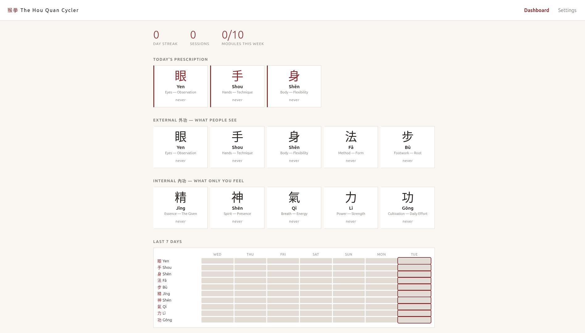
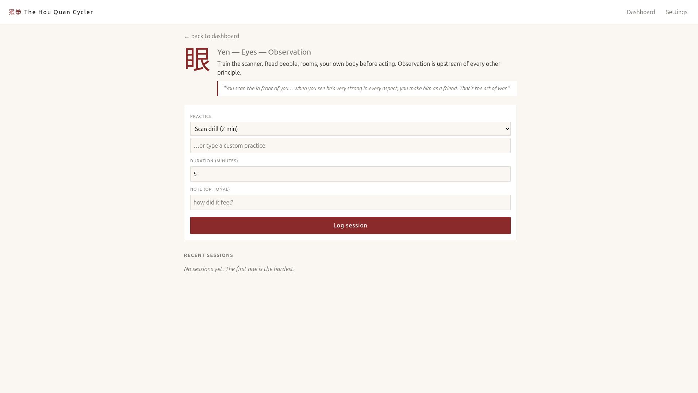

# 猴拳 The Hou Quan Cycler

A ten-module practice tracker keyed to Grandmaster **Jiang Yu Shan's** Monkey
Fist Kung Fu principles — five outward (外功), five inward (內功). One
single-file HTML app that keeps workout, stretching, breath, observation,
form study and daily cultivation under a single roof, and makes neglect
visible.

> *"If you train once or twice a week, you will gain nothing. I consider
> myself a slow learner. Even I practice every day. Be first one."*
> — Jiang Yu Shan



---

## What it does

- **Today's prescription** picks the three most-neglected modules and puts
  them at the top. Tap one, log a session, the tile flips green.
- **Ten tiles** — the five external principles and the five internal,
  each with its Chinese glyph, its mission, and days-since-last-practice.
- **Seven-day heatmap** — every module × every day, one cell each.
  Empty rows make the gaps in your cycle impossible to ignore.
- **Module detail** opens Jiang's own quote for that principle, a list
  of pre-loaded practices (editable), and a log form.



---

## The ten modules

### External 外功 — what people see

| Glyph | Name | Mission |
|:---:|---|---|
| 眼 | **Yen** · Eyes / Observation | Train the scanner. Read people, rooms, your own body before acting. |
| 手 | **Shou** · Hands / Technique | Condition, differentiate, sensitize. The small grabbing hand and the smashing hand are different tools. |
| 身 | **Shēn** · Body / Flexibility | A body soft like a dragon's breath — flexible, joints that don't snap. |
| 法 | **Fǎ** · Method / Form | The framework is a path, not the destination. Pick one form and practice it deeply. |
| 步 | **Bù** · Footwork / Root | Borrow power from the ground. Stable trunk, quick feet. |

### Internal 內功 — what only you feel

| Glyph | Name | Mission |
|:---:|---|---|
| 精 | **Jīng** · Essence / The Given | Honor the body you inherited. You can't build Jing — only spend or protect it. |
| 神 | **Shén** · Spirit / Presence | Position yourself so others are safe. Cultivate the codex. |
| 氣 | **Qì** · Breath / Energy | Learn both roads — Wind Road (fast, anaerobic) and Fire Road (slow, build). |
| 力 | **Lì** · Power / Strength | Actually build strength. Don't romanticize weakness. |
| 功 | **Gōng** · Cultivation / Daily Effort | Keep showing up. Gong is the measurement of the other nine. |

---

## Quick start

```
open index.html
```

That's it. Works from `file://`, works on a phone, works offline. Data
lives in `localStorage` under `amonkey_cycler_v1`. Settings panel has
JSON export / import for backup or moving between devices.

A four-step wizard runs the first time (**猴拳 The Door**) and is
rerunnable from Settings.

---

## Sources

Two YouTube videos are the backbone:

1. **Jesse Enkamp × Grandmaster Jiang Yu Shan** —
   [*The Banned Fighting Style That Special Forces Use*](https://www.youtube.com/watch?v=IeiPZyrK85c)
   — Jiang's ten principles (5+5) are drawn verbatim from the second
   half of this video.
2. **Kettlebell Complex** —
   [*Soviet Workout Makes Skinny Men Brutally Strong*](https://www.youtube.com/watch?v=sr0PP6nSOV8)
   — feeds Module 9 (Lì / Power): 4 push-ups on bells → 4 rows → 4
   cleans → 4 front squats → 12 swings, 20-min loop.

Further reading on Jiang's system:
- [Warrior Neigong: Internal & External Kung Fu by Jiang Yu Shan](https://warriorneigong.com/internal-external-kungfu/)
- [VAHVA Fitness: Who is Jiang Yu Shan](https://vahvafitness.com/who-is-jiang-yu-shan-hisham-al-haroun/)
- [Monkey Kung Fu on Wikipedia](https://en.wikipedia.org/wiki/Monkey_Kung_Fu)

The curated philosophy notes are in [`context.md`](context.md) — the
backbone file, pointing at the original videos and articles above.
`CLAUDE.md` is the operating card for AI sessions working on this
codebase.

---

## Tech notes

- One file: [`index.html`](index.html). HTML + inline CSS + inline JS.
- No build step, no framework, no package manager, no CDN.
- `localStorage` persistence. JSON export/import for portability.
- No backend, no accounts, no telemetry. Data stays on your device.
- ~1000 lines total; browse the source to see the data layer first
  (pure functions) and the view layer underneath.

---

## Philosophy

The app is secondary to the *way* it gets used. Each module is a
**mission to progress in**, not a checkbox. The prescription, the
heatmap, and the streak are there to make the cycle visible — so you
notice which road you've been avoiding.

> *"Demon's hand, Buddha's heart"* — sharp capability inside an ethical
> frame. The phrase is Jiang's; it applies to code and training alike.

---

## License

Personal project. The app source is free to read, fork, and adapt.
Third-party material referenced in `context.md` (video links, article
URLs) remains under the original rights of its creators — follow the
links to the source.
